# Aiba


**Desktop productivity companion for Windows** — plan the day, protect a focus block, then wrap up with a clear next step. Local-first Electron widget with a small geisha-inspired companion.

Originally a personal gift built quickly and left on my machine. I later rebuilt it for portfolio work: clearer architecture, Preferences, session history, and offline Ask Aiba help.

| | |
| --- | --- |
| **Source** | [github.com/ikrame-ih/aiba-widget](https://github.com/ikrame-ih/aiba-widget) |
| **Platform** | Windows (Electron) |
| **Data** | Local JSON only — no account, no cloud |

## Highlights

- **Plan / Focus / Unwind** — three manual modes (last choice remembered)
- **Compact + expanded** — timer widget and full studio shell with sidebar companion
- **Sessions** — local history; patterns unlock after enough completed blocks
- **Tunnel vision + focus guard** — dim desktop during focus; optional reversible site block
- **Ask Aiba** — offline FAQ (EN / ES)
- **Preferences** — theme, language, reduced motion, focus environment

## Preview

<table>
  <tr>
    <td width="50%" valign="top">
      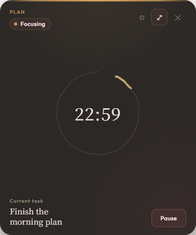
      <br /><sub><b>Compact</b> — dark</sub>
    </td>
    <td width="50%" valign="top">
      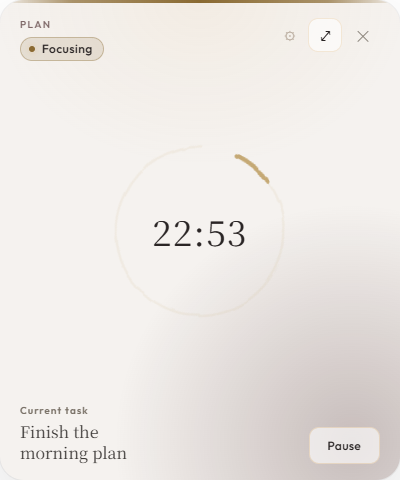
      <br /><sub><b>Compact</b> — light</sub>
    </td>
  </tr>
  <tr>
    <td width="50%" valign="top">
      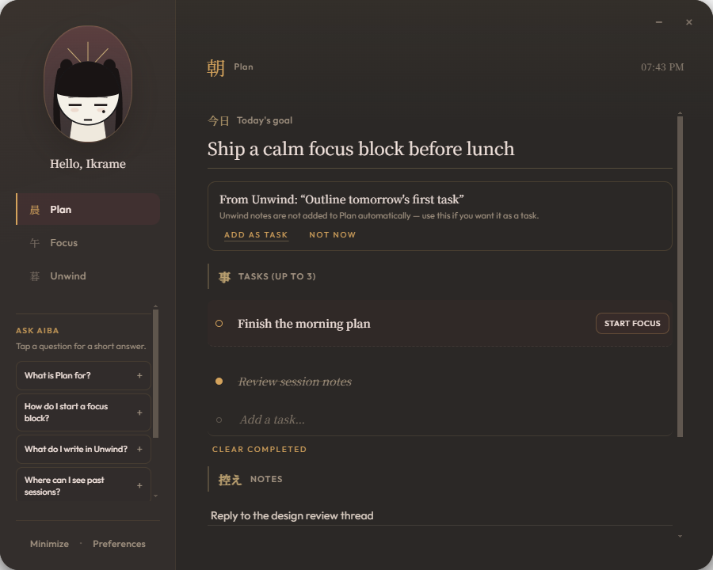
      <br /><sub><b>Plan</b> — dark</sub>
    </td>
    <td width="50%" valign="top">
      
      <br /><sub><b>Plan</b> — light</sub>
    </td>
  </tr>
  <tr>
    <td width="50%" valign="top">
      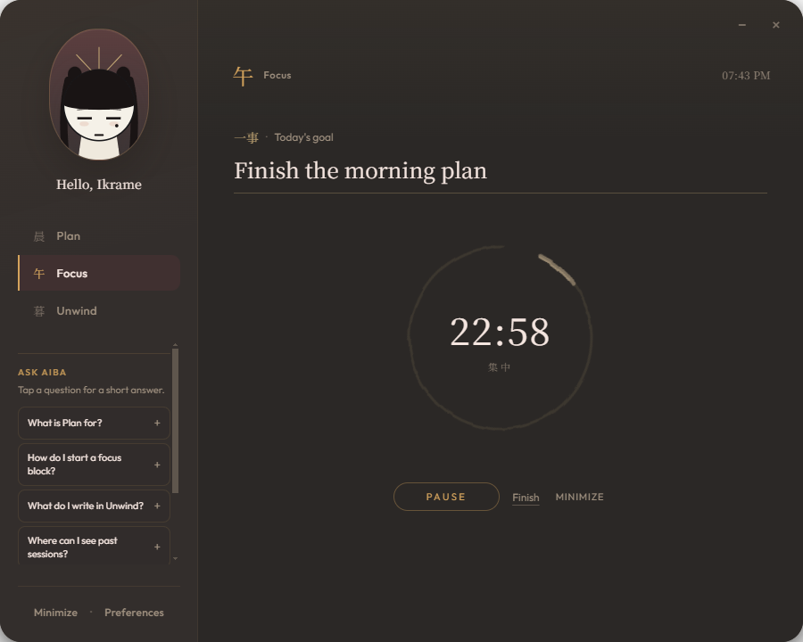
      <br /><sub><b>Focus</b> — dark</sub>
    </td>
    <td width="50%" valign="top">
      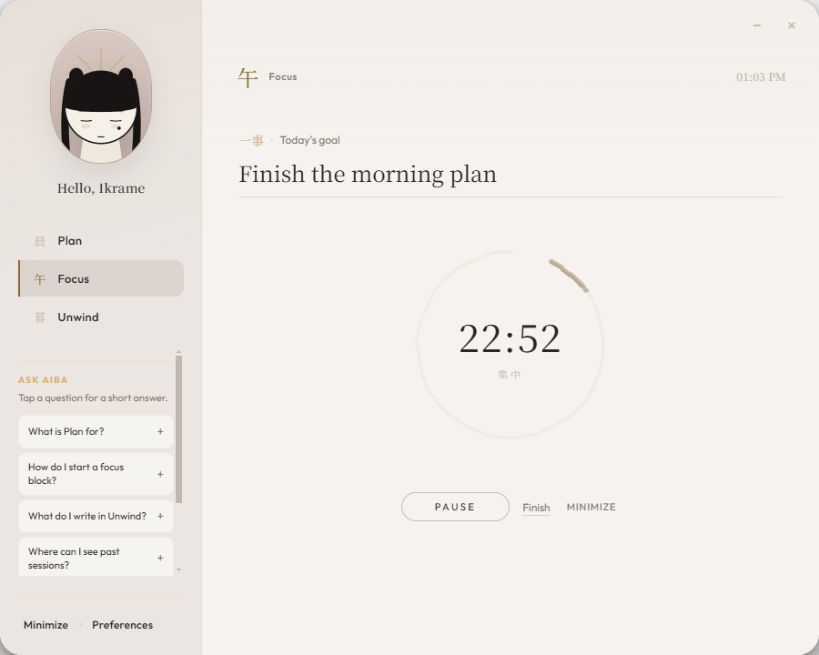
      <br /><sub><b>Focus</b> — light</sub>
    </td>
  </tr>
  <tr>
    <td width="50%" valign="top">
      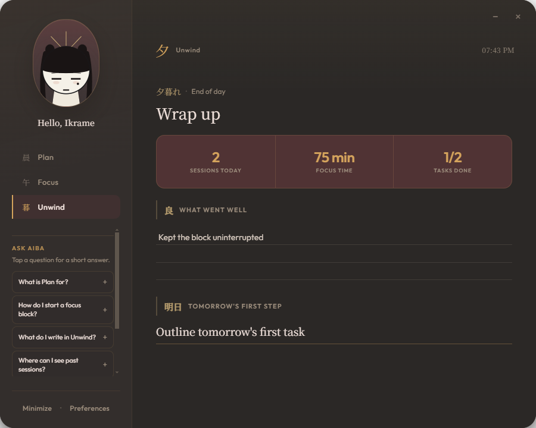
      <br /><sub><b>Unwind</b> — dark</sub>
    </td>
    <td width="50%" valign="top">
      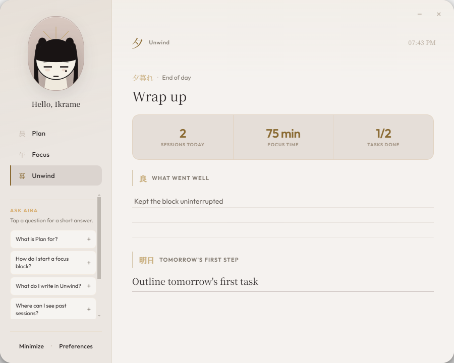
      <br /><sub><b>Unwind</b> — light</sub>
    </td>
  </tr>
  <tr>
    <td width="50%" valign="top">
      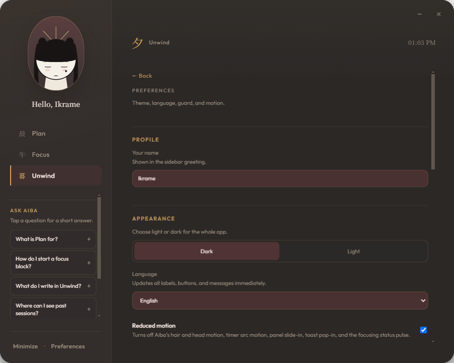
      <br /><sub><b>Preferences</b> — dark</sub>
    </td>
    <td width="50%" valign="top">
      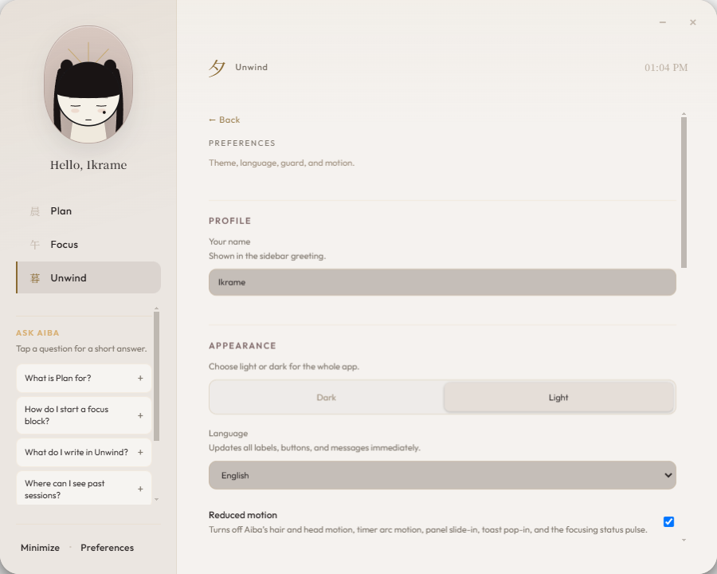
      <br /><sub><b>Preferences</b> — light</sub>
    </td>
  </tr>
  <tr>
    <td width="50%" valign="top">
      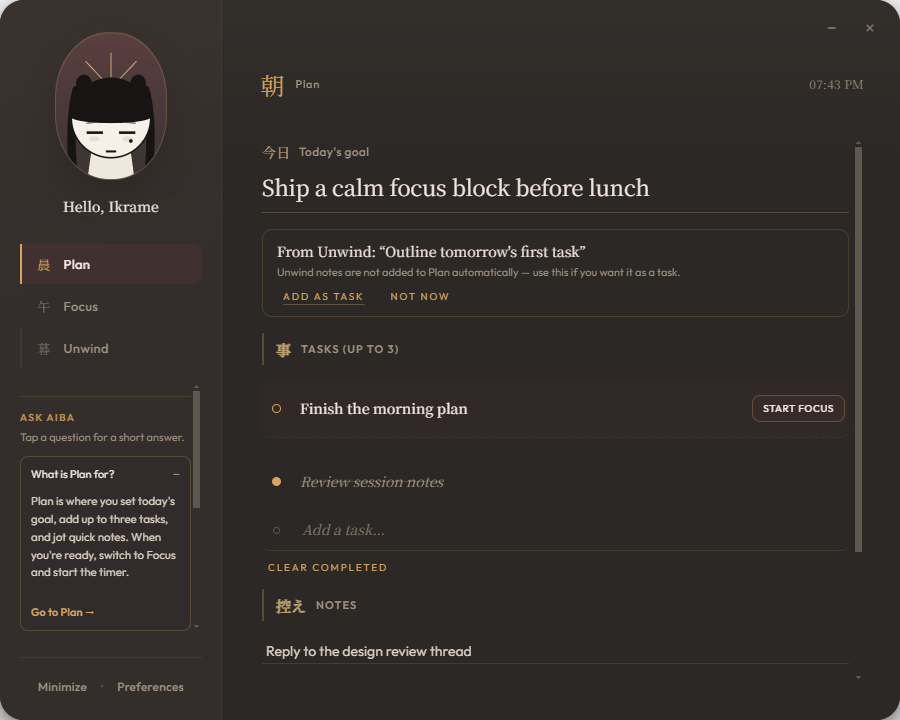
      <br /><sub><b>Ask Aiba</b> — dark</sub>
    </td>
    <td width="50%" valign="top">
      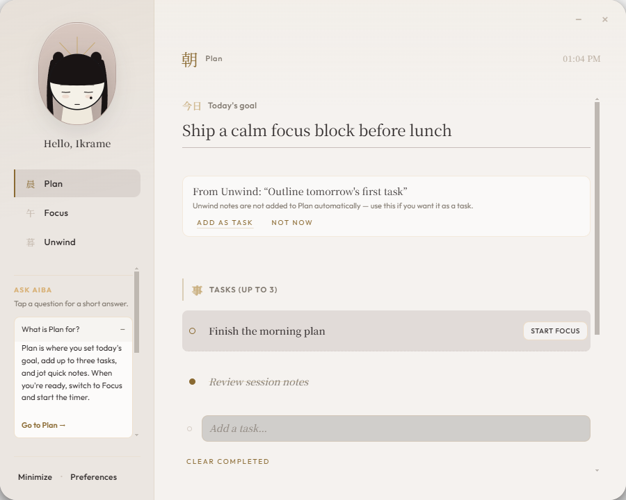
      <br /><sub><b>Ask Aiba</b> — light</sub>
    </td>
  </tr>
</table>

## Quick start

**Prerequisites:** Node.js 20+, Windows, npm.

```bash
git clone https://github.com/ikrame-ih/aiba-widget.git
cd aiba-widget
npm install
npm run dev
```

Production build:

```bash
npm run build
npm start
```

| Mode | Size |
| --- | --- |
| Compact | 400 × 480 |
| Expanded | 900 × 720 |

## Scripts

| Command | Purpose |
| --- | --- |
| `npm run dev` | Vite + Electron |
| `npm run build` | Production renderer build |
| `npm start` | Run built app |
| `npm test` | Vitest (schema, session, bounds…) |
| `npm run typecheck` | TypeScript (`tsc --noEmit`) |
| `npm run test:electron` | Electron smoke (compact + expanded) |
| `npm run capture:readme` | Regenerate README screenshots (dark + light) |

## Stack

Electron 35 · React 19 · TypeScript · Vite 6 · Vitest

## Project layout

```
electron/            # Main process, preload, storage, guard
src/shared/          # Schema, EN/ES copy, session machine, help
src/windows/main/    # React app (compact + studio)
src/windows/help/    # Break-guide window
src/assets/          # App icon / favicon
tests/               # Logic + Electron smoke
docs/images/         # README screenshots
scripts/             # README capture launcher
```

## Regenerate screenshots

Deletes previous PNGs under `docs/images/`, then captures the real widget in **dark** and **light**:

```bash
# PowerShell — wipe old captures (including any leftover mockups)
Remove-Item -Force docs\images\*.png -ErrorAction SilentlyContinue

# Capture from Electron (build + dark/light suite)
npm run capture:readme
```

## Documentation

Internal notes live in [`docs/`](docs/) — product and design context.

## License

© Ikrame Ibn Hayoun. Source available in this repository for portfolio review.

## Author

**Ikrame Ibn Hayoun** — [Portfolio](https://ikrame-ih.vercel.app/) · [GitHub](https://github.com/ikrame-ih) · [LinkedIn](https://www.linkedin.com/in/ikrame-ih/)
