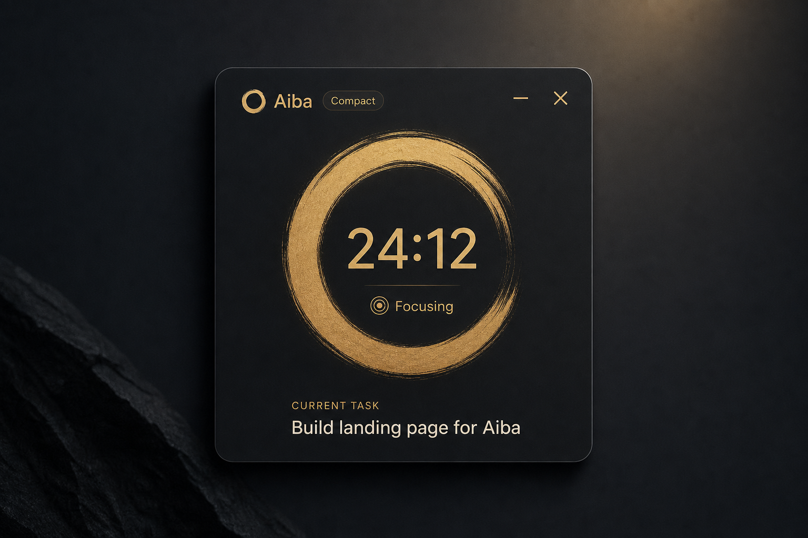
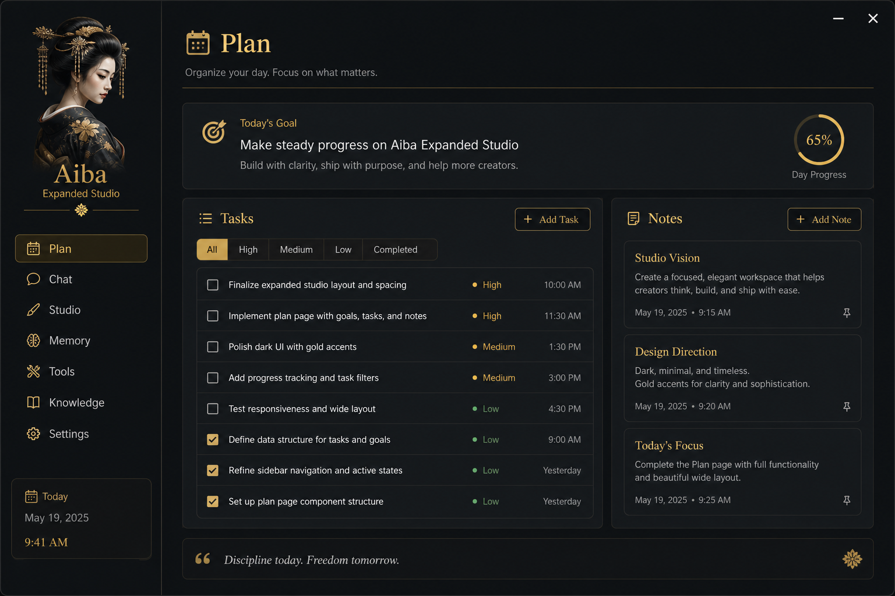
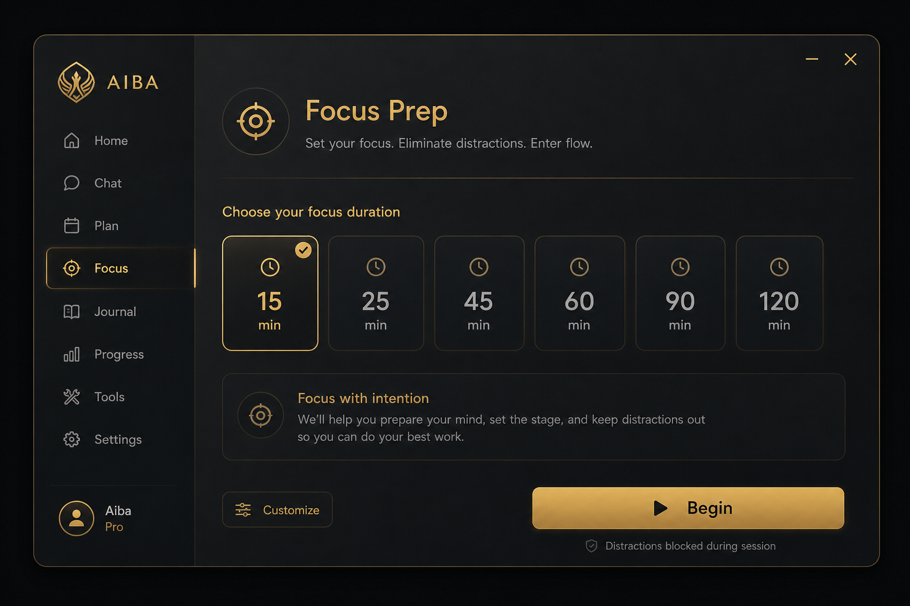
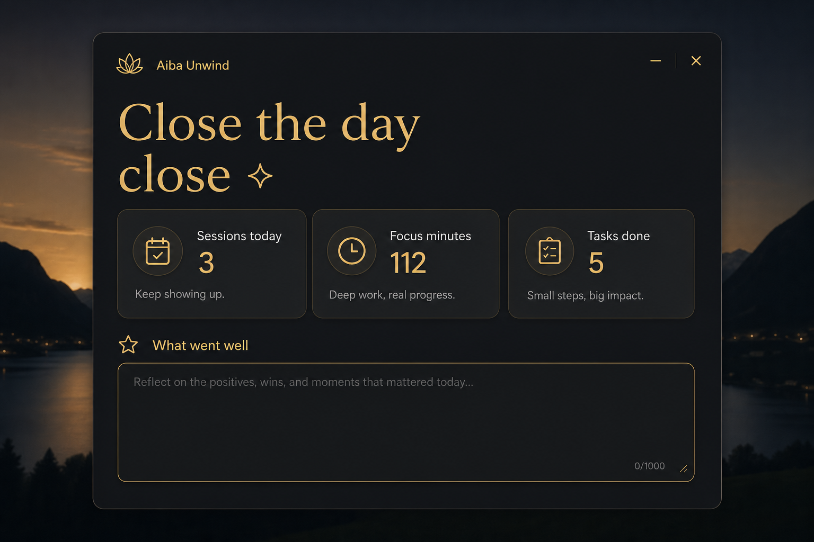
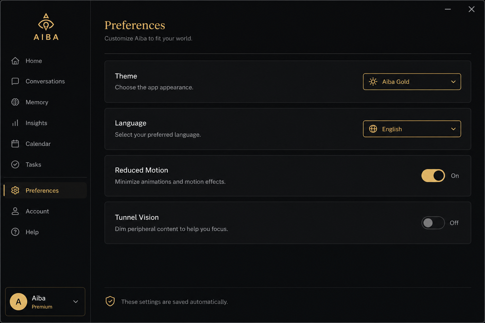
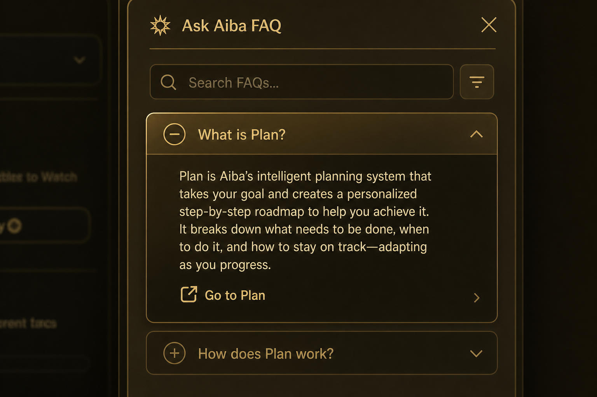

# Aiba

A desktop productivity companion for Windows. Plan the day, protect a focus block, then wrap up with a clear next step — with a small geisha-inspired mascot keeping you company.

---

## Context

I started Aiba as a personal gift. I built the first version quickly, with more care than architecture, and it sat on my computer for months.

When I opened it again, it no longer matched what I knew how to build — or what I wanted to show. So I picked it back up: reorganized the code, separated Electron and React more clearly, added Preferences, session history, offline help, and polished the UI until it felt actually usable.

It is still a small project, but much sturdier than the first pass.

---

## Demo

<!-- Add a GIF or short video link when you have one -->

_Coming soon._

---

## Screenshots

### Compact timer



### Plan



### Focus



### Unwind



### Preferences



### Ask Aiba



> Images in `docs/images/` are reference mockups for the README.
> Replace them with real captures from `npm run dev` when you can (same filenames).

---

## Features

- **Plan / Focus / Unwind** — three manual modes (last choice is remembered)
- **Compact widget** — timer with arc, pause, and expand
- **Expanded studio** — sidebar with Aiba, phase nav, and FAQ
- **Sessions** — local history and patterns once you have enough data
- **Tunnel vision** — dims the desktop during focus
- **Focus guard** — concentration helpers + optional reversible site block
- **Ask Aiba** — offline FAQ answers (EN / ES)
- **Preferences** — theme, language, reduced motion, focus environment
- **Local data only** — no account, no cloud

---

## Tech Stack

| Layer | Tech |
|-------|------|
| Desktop | Electron 35 |
| UI | React 19 + TypeScript |
| Build | Vite 6 |
| Tests | Vitest |

---

## Setup

```bash
npm install
```

## Usage

Development (Vite + Electron):

```bash
npm run dev
```

Local production build:

```bash
npm run build
npm start
```

Tests and types:

```bash
npm test
npm run typecheck
```

### Window sizes

| Mode | Size |
|------|------|
| Compact | 400 × 480 |
| Expanded | 900 × 720 |

---

## Project structure

```
electron/               # Main process, preload, storage, guard
src/shared/             # Schema, EN/ES copy, session machine, help
src/windows/main/       # React app (compact + studio)
src/windows/help/       # Break-guide window
src/assets/             # App icon / favicon
tests/                  # Logic tests (schema, session, bounds…)
docs/                   # Product notes + README images
```

How the pieces split:

- **Electron** owns the window, IPC, storage, and Windows-specific bits (hosts / overlay).
- **React** owns the UI and session state wiring.
- **`src/shared`** is what both (and the tests) can read without tight coupling.

---

## Technical decisions

**Why Electron + React**  
I wanted an always-visible desktop widget, not a website. Electron gives the frameless window; React makes Plan / Focus / Unwind easier to iterate without reinventing the DOM.

**Local JSON state**  
There is no backend. The schema lives in `data-schema.js` with migrations, so I can change the data shape without breaking older installs.

**Separate session machine**  
The timer flow (focus → recovery → review) lives in `session-machine.js`. The UI does not invent transitions, and tests can cover the flow without booting Electron.

**EN / ES copy**  
Almost all strings come from `src/shared/copy`. That keeps stray hard-coded text down and makes language switching a Preferences toggle.

**Ask Aiba offline**  
I started with a free-text matcher and landed on a topic FAQ. The resolver is still there (and tested) if I bring a search box back; the FAQ is clearer for first-time use.

**Layered CSS**  
There are several stylesheets (`tokens`, `app`, `studio-refine`…). Not the cleanest setup, but it let me iterate the UI without rewriting everything at once. I would consolidate if the project grows.

**Accessibility (basics)**  
Chrome buttons have labels, the FAQ uses `aria-expanded`, panels have `aria-label`, and key controls show a focus ring. Not a full a11y audit — just not left to chance.

---

## Possible next steps

- Windows installer (electron-builder)
- Optional sounds when a block ends
- Export / import the local JSON
- Free-text Ask Aiba (reuse the resolver)
- Playwright UI tests against the Electron window
- Configurable global shortcuts in Preferences

---

## What I learned

**At first** I learned how to ship a usable desktop app quickly: frameless window, drag regions, a timer that survives minimize. I also learned that “works on my machine” is not the same as “easy to maintain.”

**Coming back to it** I learned to cut: old import folders, unused assets, CSS for screens that no longer exist. Splitting schema / session / UI forced real tests. Writing bilingual copy without duplicating logic helped too.

Main takeaway: a portfolio piece does not need to be huge. It needs to look cared for.

---

## License

ISC · Built by Tizza
