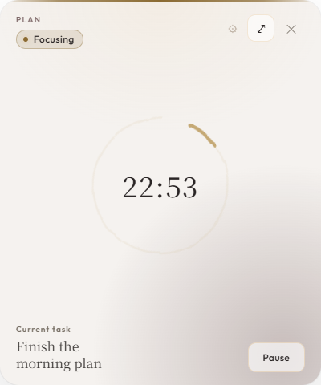
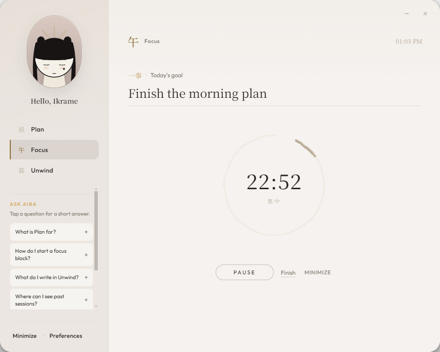
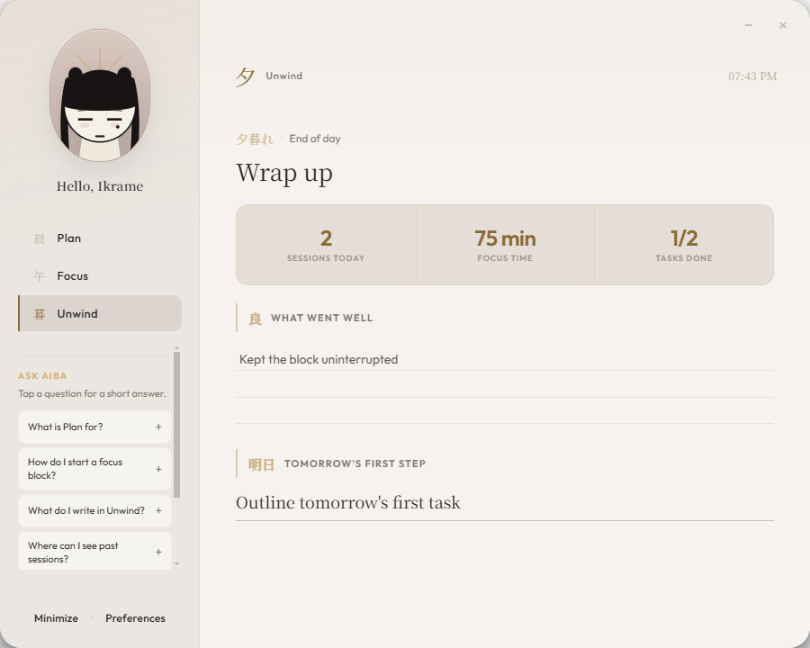
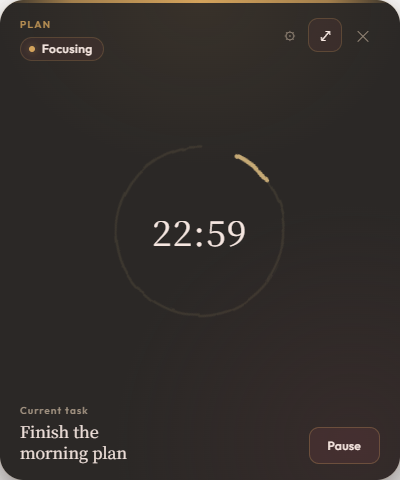
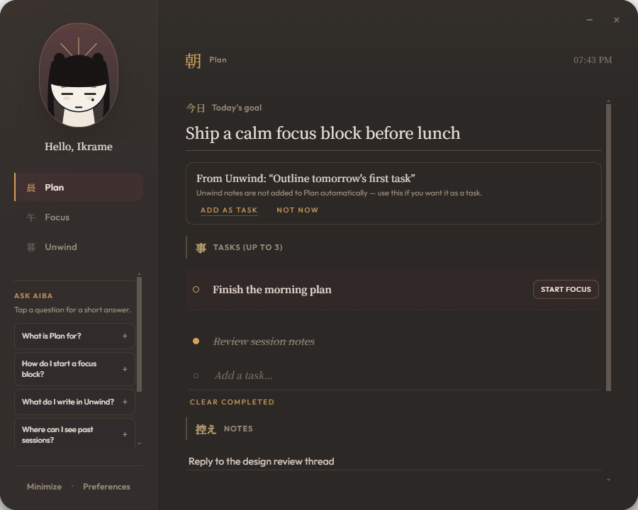
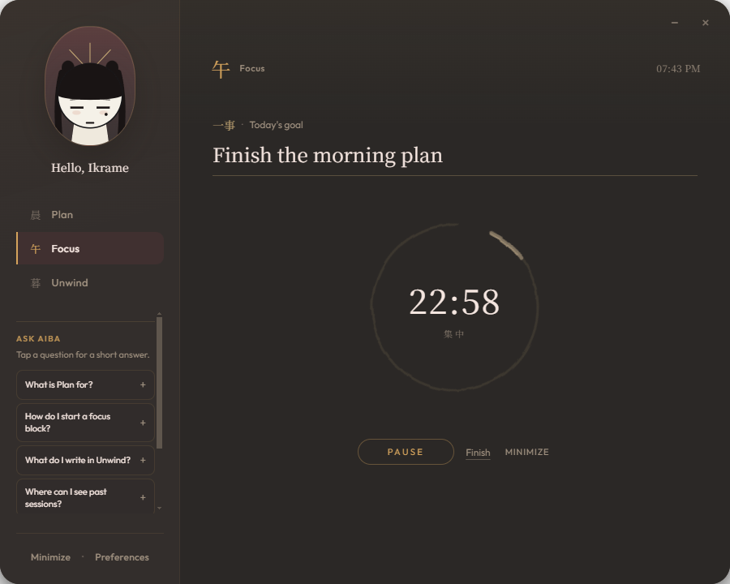
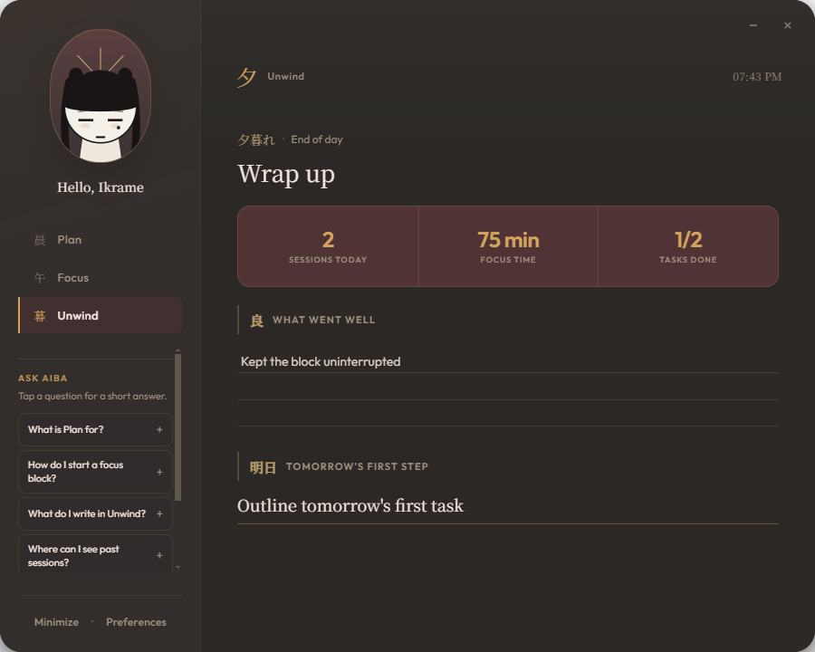
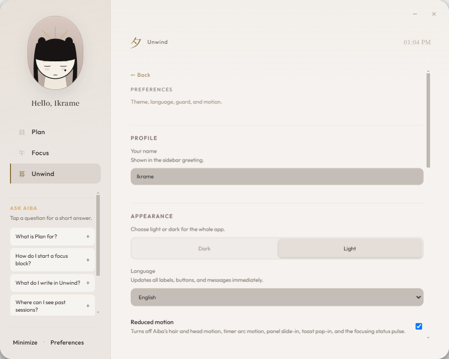
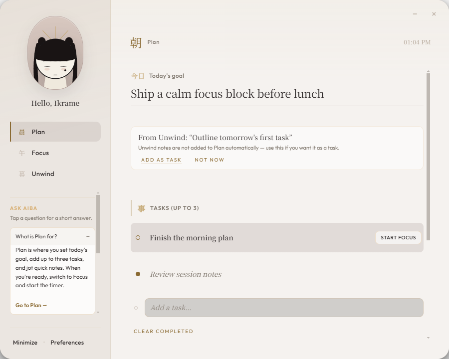

# Aiba

<p>
  
</p>

**A small Windows widget I first built as a gift** — plan the day, protect a focus block, then unwind. Local JSON only. No account, no cloud.

Electron · React 19 · TypeScript · Vite

| | |
| --- | --- |
| **Source** | [github.com/ikrame-ih/aiba-widget](https://github.com/ikrame-ih/aiba-widget) |
| **Platform** | Windows |

## What it does

- **Plan / Focus / Unwind** — three modes; last choice remembered
- **Compact + expanded** — timer widget or full studio with sidebar companion
- **Focus guard** — dim desktop; optional reversible site block
- **Ask Aiba** — offline FAQ (EN / ES)
- **Preferences** — theme, language, reduced motion

## Preview

<table>
  <tr>
    <td width="50%"><br /><sub>Compact</sub></td>
    <td width="50%"><br /><sub>Plan</sub></td>
  </tr>
  <tr>
    <td width="50%"><br /><sub>Focus</sub></td>
    <td width="50%"><br /><sub>Unwind</sub></td>
  </tr>
</table>

<details>
<summary>Dark theme &amp; more</summary>

<table>
  <tr>
    <td></td>
    <td></td>
  </tr>
  <tr>
    <td></td>
    <td></td>
  </tr>
  <tr>
    <td></td>
    <td></td>
  </tr>
</table>

</details>

## Run

```bash
git clone https://github.com/ikrame-ih/aiba-widget.git
cd aiba-widget
npm install
npm run dev
```

| Command | Purpose |
| --- | --- |
| `npm run dev` | Vite + Electron |
| `npm run build && npm start` | Production build |
| `npm test` | Vitest |
| `npm run typecheck` | `tsc --noEmit` |

## Layout

```
electron/          # main process, preload, focus guard
src/shared/        # schema, EN/ES copy, session machine
src/windows/main/  # React UI
tests/
```

## License

MIT — see [LICENSE](./LICENSE).

## Author

**Ikrame Ibn Hayoun** — [Portfolio](https://ikrame.dev/) · [GitHub](https://github.com/ikrame-ih) · [LinkedIn](https://www.linkedin.com/in/ikrame-ih/)
